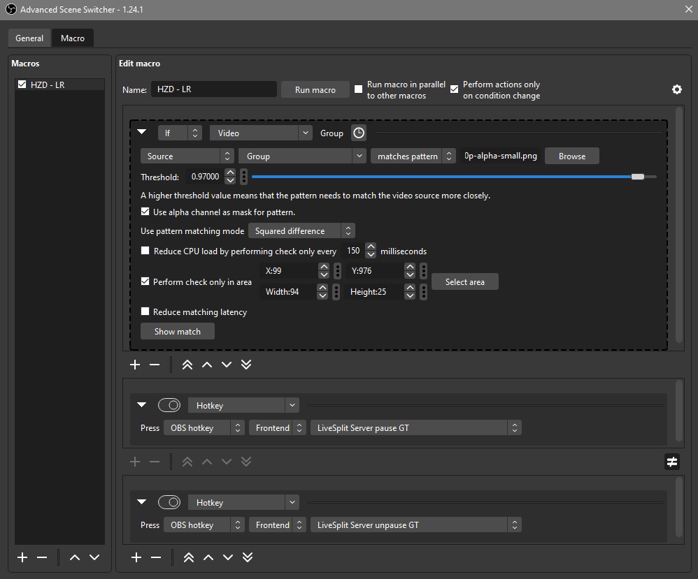

# HZD Load Remover

This repository serves as an setup manual for a load remover for Horizon Zero Dawn speedruns.

At its core, the load remover is using the Advanced Scene Switcher plugin in OBS to determine if a loadscreen is active and gives the pause / resume commands to the LiveSplit Server component via a python script.

The current rules for the loads that count can be found [here](https://www.speedrun.com/hzd/guides/6atmp).

Based on previous work on the load remover by [Blegas78](https://github.com/blegas78/autoSplitters) and the [description in the SceneSwitcher wiki](https://github.com/WarmUpTill/SceneSwitcher/wiki/Activate-overlay-to-hide-parts-of-the-screen).

Demo of the load remover in action on all removable loads: 
[Youtube Video](https://youtu.be/XvhfdMjjPMk)

## Prerequistites
* OBS
* [Advanced Scene Switcher Plugin](https://github.com/WarmUpTill/SceneSwitcher/) (ideally 1.24 or later)
* Live Split layout with the LiveSplit Server component
* Some sort of python needs to be installed on the system. The setup below will show a system-wide installation of [Python](https://www.python.org/downloads/) 3.12

## Setup
Advanced Scene Switcher 1.24 and later contains an `else` branch in the macros, which is used here. If that is not available, another macro with the negated condition has to be added (doubling the performance impact) to resume the timer.

The setup is described for a 1080p source. Scaled sources are possible when they are fed through an extra Scene or Group; the video above is using the PC version of HZD on 1440p scaled to the canvas in a group

* Set the advanced Scene Switcher interval to the lowest possible (50ms)
* Add a new macro
* Condition:
  * Type: Video, matches pattern
  * Choose `HZD-1080p-alpha.png`
  * Threshold between `0.92` and `0.97`
  * Check the `Use alpha channel as mask` checkbox
  * Pattern matching method `Squared difference`
  * Check area (X, Y, W, H): `99,976,115,25`
  * Check `Reduce matching latency`
* Action branch 1:
  * Type: Run
  * Entry: `"<path-to-python-exe>" "<path-to-scripts>\serverCmdStandalone.py" pause`
* Action branch 2 (else):
  * Type: Run
  * Entry: `"<path-to-python-exe>" "<path-to-scripts>\serverCmdStandalone.py" unpause`

The final macro can be seen here (apart from the reduced matching latency):

The LiveSplit Server component has to be started __manually__ at every LiveSplit launch. (At least for now, maybe another DLL with autolaunch will be provided in the future)

## Generate own comparison image

Each text language, resolution and aspect ratio need its own comparison image.

To create one for your workflow follow these instructions (and create a pullrequest here if you want):

* Capture a lossless (png) screenshot of the default (FT, RFS) loading screen from your source in the resolution you want to apply the load remover later
* Crop the `Loading...` section from the screenshot, this crop will also give the area
* Open the crop in GIMP (or something else) and use the wand tool to select the surrounding and the inside of `O` s are make that fully transparent

## Improvement potential

* LS-Server:
  * Make it a websocket server so that the websocket actions from the Scene Switcher can be used
  * Visual indication in the layout similar to the global hotkey indication of
    1. whether the server is running
    2. whether the expected number of clients are connected
* Python script for OBS directly which keeps the socket connection open and works with OBS internal hotkeys for the Scene Switcher

## License

This repository is provided under MIT license. See [LICENSE.md](/LICENSE.md)
